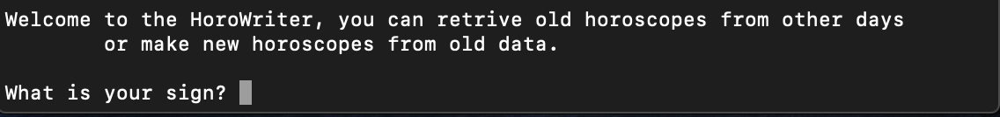
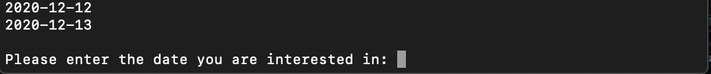

# Horoscope Scraper

(HoroScraper.py)
-----
This project is designed to scrape daily horoscopes from a popular astrology website for your convenience. The program can be scheduled with a task automator such as cron.

The following python libraries are required to run this program.

* Beautiful Soup
* Requests
* datetime

The program will automatically scape all 12 astrological signs and save them in a file called horoscopes.json. If the program is run on consecutive days, the dates and descriptions will append without overwriting the previous day's data.

-----

# Horoscope Reader and Writer
(HoroWriter.py)

The file HoroWriter.py will allow you to easily read and review your horoscope data. The program must be saved in the same file as the horoscopes.json. The program can be run from the command line and will appear as shown below:

Enter your desired astrological sign and hit enter. You will then be asked whether you want to retrieve a horoscope from an old date, or create a new one based on the old collected data.

Select `old` and you will be given all the previously available dates:

If you select new, a horoscope will be randomly generated for you based on the previous data available in the horoscopes.json file.
